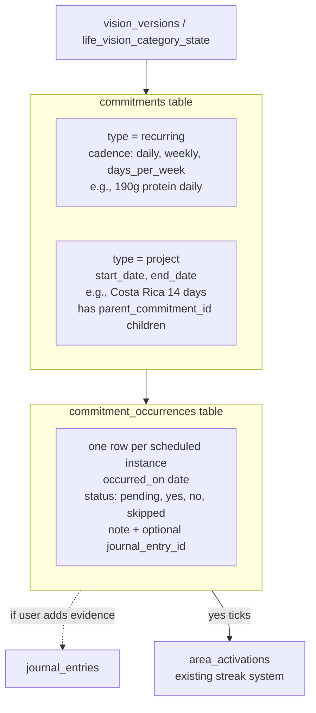
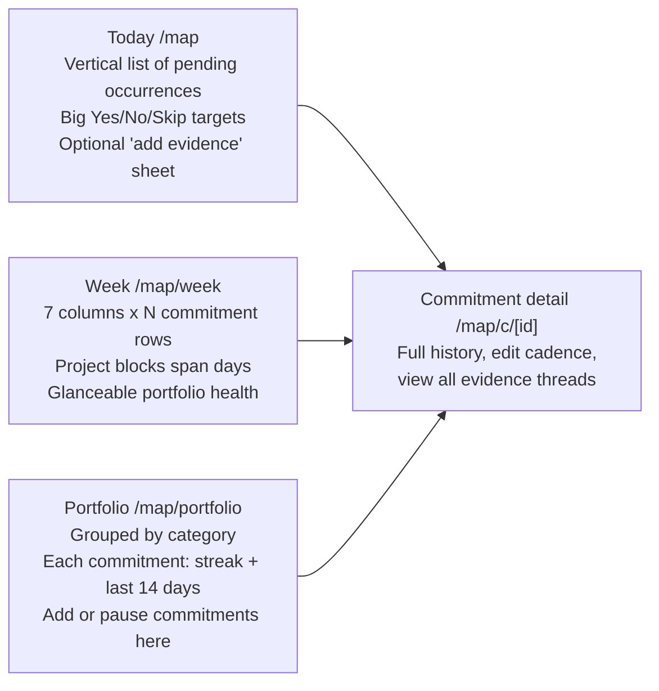

# MAP v2 — Living The Vision

## Why this plan

You have most of the pieces already; they just don't talk. `/map` schedules but doesn't verify. `/journal` verifies (logs what happened) but isn't tied to a plan. `/abundance-tracker` and `/daily-paper` log to streaks but each in their own silo. The Actualization Blueprints feature was structurally wrong (project-shaped only) and is currently broken (see [docs/misc/ACTUALIZATION_BLUEPRINTS_BROKEN.md](docs/misc/ACTUALIZATION_BLUEPRINTS_BROKEN.md)).

Your Costa Rica example unlocked the real model: **a portfolio of concurrent commitments**, where recurring threads (190g protein, daily movement, social content) layer on top of project containers (Costa Rica trip with sub-tasks). No thread pauses for another. Every Yes is a vibrational affirmation that the user is *doing* the vision, not just planning it.

## Core model — two primitives, one feature




- **Commitment** = the thing you've committed to. Two shapes:
  - `type='recurring'` with a `cadence` JSONB (`{kind:'daily'}` | `{kind:'weekly', days:['mon','wed']}` | `{kind:'days_per_week', count:5}`).
  - `type='project'` with explicit `start_date`/`end_date`. Projects can have child commitments via `parent_commitment_id` (e.g., Costa Rica trip → "book flights", "find lodging", "homeschool plan").
- **Occurrence** = each scheduled instance to verify. Auto-generated from cadence (recurring) or from sub-task due dates (projects). The verification surface.
- **Layering is automatic** because recurring commitments generate daily occurrences regardless of whether a project is also active that day. Costa Rica's daily occurrences for protein/movement/content just appear alongside the trip's sub-task occurrences.

## Schema additions (new migration)

New file: `supabase/migrations/YYYYMMDDHHMMSS_living_the_vision.sql` (no edits to existing tables; only adds + one optional FK column on `journal_entries`).

```sql
CREATE TABLE commitments (
  id uuid PRIMARY KEY DEFAULT gen_random_uuid(),
  user_id uuid NOT NULL REFERENCES auth.users(id) ON DELETE CASCADE,
  vision_version_id uuid REFERENCES vision_versions(id) ON DELETE SET NULL,
  category text NOT NULL,                 -- LifeCategoryKey
  parent_commitment_id uuid REFERENCES commitments(id) ON DELETE CASCADE,
  type text NOT NULL CHECK (type IN ('recurring','project')),
  title text NOT NULL,
  description text,
  cadence jsonb,                           -- recurring only
  start_date date,                         -- both (recurring optional)
  end_date date,                           -- project required, recurring optional
  status text NOT NULL DEFAULT 'active'    -- active|paused|completed|archived
    CHECK (status IN ('active','paused','completed','archived')),
  imported_from_map_item_id uuid,          -- migration trace
  created_at timestamptz DEFAULT now(),
  updated_at timestamptz DEFAULT now()
);

CREATE TABLE commitment_occurrences (
  id uuid PRIMARY KEY DEFAULT gen_random_uuid(),
  commitment_id uuid NOT NULL REFERENCES commitments(id) ON DELETE CASCADE,
  user_id uuid NOT NULL,                   -- denormalized for fast RLS + queries
  occurred_on date NOT NULL,
  status text NOT NULL DEFAULT 'pending'   -- pending|yes|no|skipped
    CHECK (status IN ('pending','yes','no','skipped')),
  verified_at timestamptz,
  note text,
  journal_entry_id uuid REFERENCES journal_entries(id) ON DELETE SET NULL,
  alignment text CHECK (alignment IN ('above','below','neutral')),
  created_at timestamptz DEFAULT now(),
  updated_at timestamptz DEFAULT now(),
  UNIQUE (commitment_id, occurred_on)
);

ALTER TABLE journal_entries
  ADD COLUMN commitment_occurrence_id uuid 
  REFERENCES commitment_occurrences(id) ON DELETE SET NULL;

CREATE INDEX idx_commitments_user_status ON commitments(user_id, status);
CREATE INDEX idx_commitments_parent ON commitments(parent_commitment_id);
CREATE INDEX idx_occurrences_user_date ON commitment_occurrences(user_id, occurred_on);
CREATE INDEX idx_occurrences_commitment ON commitment_occurrences(commitment_id, occurred_on);
```

Plus standard RLS (user owns rows via `user_id`).

## Decisions baked in (with rationale)

These are the forks I made so the plan can land. Push back on any of them.

- **Journal evidence is optional, but the lightweight default**. Tapping Yes is one tap. If the user opts to add a note/photo/audio/video, we **create a real `journal_entries` row** and bidirectionally link via `commitment_occurrence_id` (FK on `journal_entries`) and `journal_entry_id` (FK on the occurrence). Evidence is then visible in `/journal` AND tied to the commitment. Zero new media plumbing — reuse [src/components/RecordingTextarea.tsx](src/components/RecordingTextarea.tsx), `FileUpload`, S3 `journal/uploads`, `audio_recordings` JSONB.
- `**/map` URL stays.** Same acronym, same muscle memory. Internal naming evolves: "My Activation Plan" → "My Actualization Plan." User-visible nav copy can stay "MAP" or become "Living The Vision" — that's a brand call, not a code call.
- **MVP cadence support: `daily` and `days_per_week` only.** Covers all four of your real commitments (protein/move/content/trip). Add `weekly:days` and custom-interval in v1.1 once you've used it.
- **Occurrences are generated lazily in a 14-day rolling window.** A daily cron (or RPC on first daily login) materializes upcoming occurrences for active commitments, capped 14 days out. Past pending occurrences auto-mark `no` after a 48h grace window (configurable per commitment). This avoids generating millions of empty future rows.
- **Streaks reuse `area_activations**` (created in [supabase/migrations/20260324120000_create_area_activations.sql](supabase/migrations/20260324120000_create_area_activations.sql)). When an occurrence flips to `yes`, we write to `area_activations` with `area = 'map'` (and optionally a per-commitment area). All your existing badge/streak UI already reads from this — no new streak engine needed.
- **VIVA's role in v1 is reflective only.** No AI-generated commitments. Weekly portfolio digest: "You moved 5/7 days, hit protein 6/7, posted content 3/7. Costa Rica is on track. Want to talk about content?" Trade tokens for the weekly summary; rate-limit to one paid summary per week.
- **Blueprints retires.** The page at [src/app/actualization-blueprints/page.tsx](src/app/actualization-blueprints/page.tsx) currently 404s on its API call. Move to `_archive/`, mark the registry entry `ARCHIVED` with note "Replaced by MAP v2."

## UI surfaces (3 views, then a 4th if/when stable)




The Today view is the daily-driver. Week view is the magic — it's where Costa Rica appears as a 14-day block AND the protein/movement/content rows tick across it. Portfolio is the Sunday-planning surface for adding/editing commitments.

For component fidelity, all three reuse [src/lib/design-system/components.tsx](src/lib/design-system/components.tsx) (Card, Button, ProgressBar, Badge). No new design primitives.

## Migration from existing MAP

Migrate, don't drop, existing `user_maps` + `user_map_items`:

- Each active `user_map_items` row → one `commitments` row with `type='recurring'`, `cadence='{kind:"weekly", days:[...]}'`, `imported_from_map_item_id` set for trace.
- Existing `scheduled_messages` for SMS reminders **keep working unchanged**. We add new reminder rows when commitments fire, using the same plumbing.
- Old `/map` page renders the new Today view; old behaviors (SMS opt-in, weekly schedule) remain accessible via the Portfolio view's commitment editor.
- Zero downtime migration: data flows in, UI swaps, SMS keeps firing.

## What's explicitly OUT of v1 (so we don't drift back into Blueprints)

- AI-generated commitment plans. (User picks what feels aligned. VIVA only reflects.)
- Phases, dependencies, success criteria, priority levels (these killed Blueprints v1).
- Task assignment to others / household sharing of commitments.
- Public sharing or social streaks.
- Calendar import/export.
- Native push notifications (SMS only via existing `scheduled_messages`).
- Custom evidence requirements per commitment ("must include photo").
- `weekly:days` and custom-interval cadences.
- Cross-commitment correlation insights ("you posted more on days you moved").

These are all v1.1+ once the core loop is sticky.

## File map (where new code lives)

- [src/app/map/page.tsx](src/app/map/page.tsx) — rewrite to Today view (was the existing MAP hub)
- `src/app/map/week/page.tsx` — new
- `src/app/map/portfolio/page.tsx` — new
- `src/app/map/c/[id]/page.tsx` — new
- `src/app/map/c/[id]/edit/page.tsx` — new
- `src/app/map/new/page.tsx` — replace existing builder; add type=recurring|project flow
- `src/app/api/map/commitments/route.ts` — new (CRUD)
- `src/app/api/map/occurrences/route.ts` — new (verify, link evidence)
- `src/app/api/map/generate-occurrences/route.ts` — new (cron-callable)
- `src/lib/map/types.ts` — `Commitment`, `CommitmentOccurrence`, `Cadence` types
- `src/lib/map/cadence.ts` — pure cadence math (next N occurrences from a date)
- `src/lib/map/occurrence-generator.ts` — materializes window
- `src/lib/viva/prompts/map-weekly-reflection-prompt.ts` — new VIVA prompt
- [FEATURE_REGISTRY.md](FEATURE_REGISTRY.md) — bump MAP entry, ARCHIVE Blueprints
- `docs/features/map/README.md` — new feature doc

## Two open decisions before code

I made calls on these but want explicit confirmation because they're load-bearing:

1. **Confirm: optional journal evidence with auto-create on add** (recommendation above) — vs. inline-only evidence on the occurrence row, vs. always-prompt-for-journal-entry.
2. **Confirm: ship MAP v2 with both `recurring(daily, days_per_week)` and `project` types in v1**, OR ship only `recurring(daily)` first as a tighter wedge and add `project` (Costa Rica) in v1.1.

Once confirmed, the todo list below executes in order.