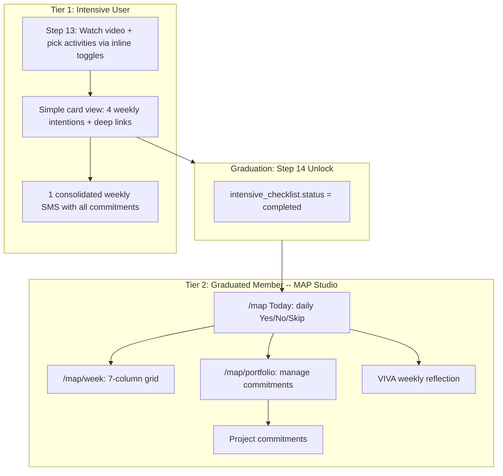
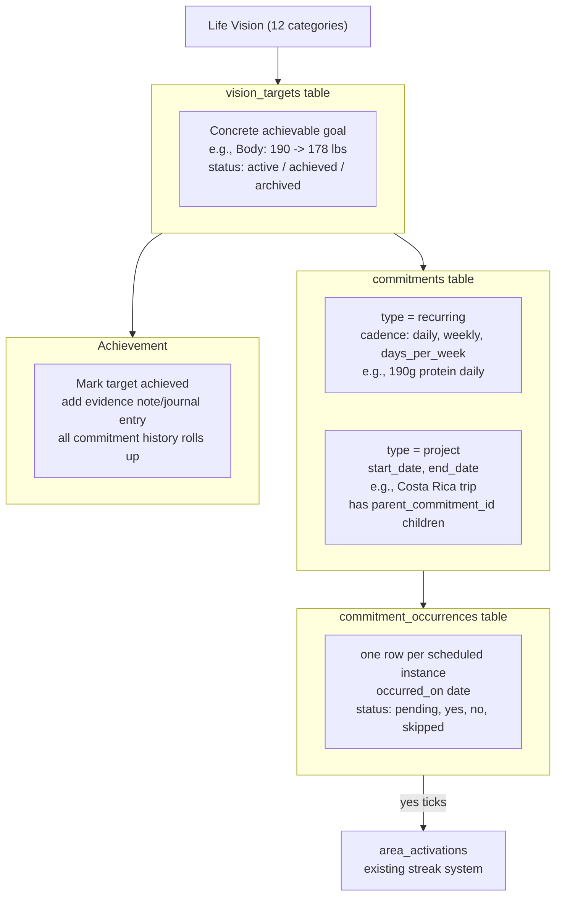
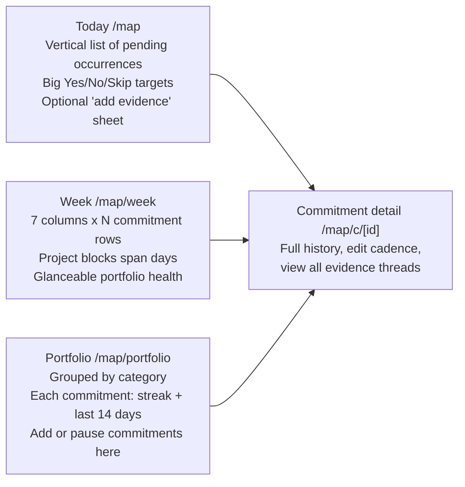

# MAP v2 — Living The Vision

## Why this plan

You have most of the pieces already; they just don't talk. `/map` schedules but doesn't verify. `/journal` verifies (logs what happened) but isn't tied to a plan. `/abundance-tracker` and `/daily-paper` log to streaks but each in their own silo. The Actualization Blueprints feature was structurally wrong (project-shaped only) and is currently broken (see [docs/misc/ACTUALIZATION_BLUEPRINTS_BROKEN.md](docs/misc/ACTUALIZATION_BLUEPRINTS_BROKEN.md)).

Your Costa Rica example unlocked the real model: **a portfolio of concurrent commitments**, where recurring threads (190g protein, daily movement, social content) layer on top of project containers (Costa Rica trip with sub-tasks). No thread pauses for another. Every Yes is a vibrational affirmation that the user is *doing* the vision, not just planning it.

## Two-tier UX: Intensive vs Graduated

A brand-new intensive user and a seasoned member need fundamentally different MAP experiences, but they share the same underlying data model so the transition is seamless.



**Tier 1 (Intensive):** Step 13 evolves from education-only to an intelligent, auto-suggested first MAP. By Step 13, the system already has everything: assessment scores (Green Line status per category), profile (current state), life vision (desired state), audio, vision board, journal. Instead of asking the user to pick activities manually, the system does the work:

1. **One universal first target (auto-created):** "Above the Green Line -- achieve an above-the-line emotional state in harmony with your new Life Vision."
2. **Personalized diagnosis:** Show which life categories are below / transition / above the Green Line, pulled from assessment results.
3. **Rule-based auto-suggestions:** Deterministic mapping from Green Line gaps to VibrationFit tool commitments. Below-the-line categories get targeted reps. The suggestions are all actions the user just built during Steps 1-12:
   - **Activate:** Morning Vision + Daily Paper (read Life Vision, scan Vision Board)
   - **Activate:** Night Sleep Immersion (play immersion track)
   - **Connect:** Vibe Tribe engagement (community support)
   - **Attend:** Alignment Gym session (live or replay)
   - **Create:** Journal entries (evidence of alignment)
4. **User reviews and accepts** (can adjust), then these become their first commitments with a consolidated weekly SMS.
5. **VIVA wobble detection (enhancement):** VIVA reads assessment + profile + vision and identifies potential wobbles -- what's in the way of getting above the line. When the user has spare time, VIVA suggests extra reps on those wobble categories.

The key insight: every suggested commitment is something the user just *built* during the intensive. MAP doesn't ask them to do new things -- it tells them how to *use their tools* to get above the Green Line. Advanced external commitments (protein tracking, Costa Rica trip) come later in the full MAP Studio after graduation.

**Tier 2 (Graduated Member):** After Step 14 unlock, the user gets the full MAP Studio with Today/Week/Portfolio views, daily verification, projects, VIVA reflection. Their Tier 1 commitments carry forward as seed data. Graduation is the transition -- no milestone gates, no feature unlocks.

## MAP Studio Architecture

MAP currently has no layout, no shared context, no area bar -- just loose pages. Every other major area (Journal, Audio, Life Vision, Vision Board, Profile, Story) follows the Studio pattern. MAP v2 adopts the same:

**New files (studio infrastructure):**
- `src/components/map-studio/MapStudioContext.tsx` -- holds commitments, today's occurrences, streak summary; shared by all `/map/*` pages
- `src/components/map-studio/MapAreaBar.tsx` -- tabs: Today | Week | Portfolio; commitment version selector on detail pages
- `src/components/map-studio/index.ts` -- barrel export
- `src/app/map/layout.tsx` -- studio layout per [rules/STUDIO_PAGE_BUILDING_RULES.md](rules/STUDIO_PAGE_BUILDING_RULES.md)

**Layout follows the standard template:**
```tsx
<MapStudioProvider>
  <MapAreaBar />
  <main className="flex-1 pt-6 pb-3 md:pt-8 md:pb-3 lg:pt-6 px-4 md:px-0"
        style={{ '--content-px': '1rem' } as React.CSSProperties}>
    {children}
  </main>
</MapStudioProvider>
```

**Registration:** Add `'/map'` to `STUDIO_ROUTE_PREFIXES` in [src/lib/navigation/page-classifications.ts](src/lib/navigation/page-classifications.ts).

## Core model — three layers



- **Vision Target** = a concrete, achievable goal extracted from a life vision category. "Go from 190 to 178 lbs" (Body). "Launch side business" (Wealth). "Costa Rica family trip" (Family). Open-ended by default -- no deadline required. Multiple commitments feed one target.
- **Commitment** = a bite-size action that feeds a target. Two shapes:
  - `type='recurring'` with a `cadence` JSONB (`{kind:'daily'}` | `{kind:'weekly', days:['mon','wed']}` | `{kind:'days_per_week', count:5}`).
  - `type='project'` with explicit `start_date`/`end_date`. Projects can have child commitments via `parent_commitment_id` (e.g., Costa Rica trip -> "book flights", "find lodging", "homeschool plan").
- **Occurrence** = each scheduled instance to verify. Auto-generated from cadence (recurring) or from sub-task due dates (projects). The verification surface. Yes/No/Skip -- pure tracking, no journal entry created.
- **Achievement** = when a vision target is done, mark it achieved + add evidence (note, optional journal entry link). All the commitment history rolls up: "200 protein days got you here."
- **Layering is automatic** because recurring commitments generate daily occurrences regardless of whether a project is also active that day. Costa Rica's daily occurrences for protein/movement/content just appear alongside the trip's sub-task occurrences.

## Schema additions (new migration)

New file: `supabase/migrations/YYYYMMDDHHMMSS_living_the_vision.sql`.

```sql
-- Vision Targets: concrete goals extracted from life vision categories
CREATE TABLE vision_targets (
  id uuid PRIMARY KEY DEFAULT gen_random_uuid(),
  user_id uuid NOT NULL REFERENCES auth.users(id) ON DELETE CASCADE,
  vision_version_id uuid REFERENCES vision_versions(id) ON DELETE SET NULL,
  category text NOT NULL,                  -- LifeCategoryKey
  title text NOT NULL,                     -- "Go from 190 to 178 lbs"
  description text,
  status text NOT NULL DEFAULT 'active'    -- active|achieved|archived
    CHECK (status IN ('active','achieved','archived')),
  achieved_at timestamptz,
  achievement_note text,                   -- freeform evidence when achieved
  achievement_journal_entry_id uuid REFERENCES journal_entries(id) ON DELETE SET NULL,
  created_at timestamptz DEFAULT now(),
  updated_at timestamptz DEFAULT now()
);

-- Commitments: bite-size actions that feed a vision target
CREATE TABLE commitments (
  id uuid PRIMARY KEY DEFAULT gen_random_uuid(),
  user_id uuid NOT NULL REFERENCES auth.users(id) ON DELETE CASCADE,
  vision_target_id uuid REFERENCES vision_targets(id) ON DELETE SET NULL,
  category text NOT NULL,                  -- LifeCategoryKey (denormalized from target for queries)
  parent_commitment_id uuid REFERENCES commitments(id) ON DELETE CASCADE,
  type text NOT NULL CHECK (type IN ('recurring','project')),
  title text NOT NULL,
  description text,
  cadence jsonb,                           -- recurring only
  start_date date,                         -- both (recurring optional)
  end_date date,                           -- project required, recurring optional
  status text NOT NULL DEFAULT 'active'    -- active|paused|completed|archived
    CHECK (status IN ('active','paused','completed','archived')),
  imported_from_map_item_id uuid,          -- migration trace
  created_at timestamptz DEFAULT now(),
  updated_at timestamptz DEFAULT now()
);

-- Occurrences: one row per scheduled instance, pure Yes/No/Skip tracking
CREATE TABLE commitment_occurrences (
  id uuid PRIMARY KEY DEFAULT gen_random_uuid(),
  commitment_id uuid NOT NULL REFERENCES commitments(id) ON DELETE CASCADE,
  user_id uuid NOT NULL,                   -- denormalized for fast RLS + queries
  occurred_on date NOT NULL,
  status text NOT NULL DEFAULT 'pending'   -- pending|yes|no|skipped
    CHECK (status IN ('pending','yes','no','skipped')),
  verified_at timestamptz,
  note text,                               -- optional quick note
  created_at timestamptz DEFAULT now(),
  updated_at timestamptz DEFAULT now(),
  UNIQUE (commitment_id, occurred_on)
);

CREATE INDEX idx_targets_user_status ON vision_targets(user_id, status);
CREATE INDEX idx_targets_category ON vision_targets(user_id, category);
CREATE INDEX idx_commitments_user_status ON commitments(user_id, status);
CREATE INDEX idx_commitments_target ON commitments(vision_target_id);
CREATE INDEX idx_commitments_parent ON commitments(parent_commitment_id);
CREATE INDEX idx_occurrences_user_date ON commitment_occurrences(user_id, occurred_on);
CREATE INDEX idx_occurrences_commitment ON commitment_occurrences(commitment_id, occurred_on);
```

Plus standard RLS (user owns rows via `user_id`).

**Key changes from earlier draft:**
- Added `vision_targets` table as the top-level goal container
- `commitments.vision_version_id` replaced with `commitments.vision_target_id` (targets hold the vision link)
- Removed `journal_entry_id` and `alignment` from occurrences -- occurrences are pure tracking (Yes/No/Skip + optional note)
- Evidence lives at the target achievement level, not per-occurrence

## Decisions (settled)

- **Evidence lives at the target level, not per-occurrence.** Occurrences are pure Yes/No/Skip tracking (with an optional quick note). When a vision target is achieved, the user adds evidence (achievement note + optional linked journal entry). This keeps daily tracking lightweight (hundreds of taps, no friction) while giving the achievement moment its weight.
- **Both recurring + project commitment types ship in v1.** Covers the full vision: recurring actions (protein, movement, content) + projects with sub-tasks (Costa Rica trip).
- **Vision targets are core to v1.** Commitments feed vision targets. The target is the "why" behind the bite-size steps. Targets can be marked achieved with evidence.
- **`/map` URL stays.** Same acronym, same muscle memory. Internal naming evolves: "My Activation Plan" -> "My Actualization Plan." User-visible nav copy can stay "MAP" or become "Living The Vision" -- brand call, not code call.
- **MVP cadence support: `daily` and `days_per_week` only.** Covers all real commitments. Add `weekly:days` and custom-interval in v1.1.
- **Occurrences are generated lazily in a 14-day rolling window.** A daily cron materializes upcoming occurrences for active commitments, capped 14 days out. Past pending occurrences auto-mark `no` after a 48h grace window. Avoids generating millions of empty future rows.
- **Streaks reuse `area_activations`** (created in [supabase/migrations/20260324120000_create_area_activations.sql](supabase/migrations/20260324120000_create_area_activations.sql)). When an occurrence flips to `yes`, we write to `area_activations`. Existing badge/streak UI already reads from this.
- **VIVA's role in v1 is reflective only.** No AI-generated commitments. Weekly portfolio digest. Token-gated.
- **Blueprints retires.** The page at [src/app/actualization-blueprints/page.tsx](src/app/actualization-blueprints/page.tsx) currently 404s. Move to `_archive/`, mark `ARCHIVED`.

## UI surfaces (3 views, then a 4th if/when stable)




The Today view is the daily-driver. Week view is the magic — it's where Costa Rica appears as a 14-day block AND the protein/movement/content rows tick across it. Portfolio is the Sunday-planning surface for adding/editing commitments.

For component fidelity, all three reuse [src/lib/design-system/components.tsx](src/lib/design-system/components.tsx) (Card, Button, ProgressBar, Badge). No new design primitives.

## Migration from existing MAP

Migrate, don't drop, existing `user_maps` + `user_map_items`:

- Each active `user_map_items` row → one `commitments` row with `type='recurring'`, `cadence='{kind:"weekly", days:[...]}'`, `imported_from_map_item_id` set for trace.
- Existing `scheduled_messages` for SMS reminders **keep working unchanged**. We add new reminder rows when commitments fire, using the same plumbing.
- Old `/map` page renders the new Today view; old behaviors (SMS opt-in, weekly schedule) remain accessible via the Portfolio view's commitment editor.
- Zero downtime migration: data flows in, UI swaps, SMS keeps firing.

## What's explicitly OUT of v1 (so we don't drift back into Blueprints)

- AI-generated commitment plans. (User picks what feels aligned. VIVA only reflects.)
- Phases, dependencies, success criteria, priority levels (these killed Blueprints v1).
- Task assignment to others / household sharing of commitments.
- Public sharing or social streaks.
- Calendar import/export.
- Native push notifications (SMS only via existing `scheduled_messages`).
- Custom evidence requirements per commitment ("must include photo").
- `weekly:days` and custom-interval cadences.
- Cross-commitment correlation insights ("you posted more on days you moved").

These are all v1.1+ once the core loop is sticky.

## File map (where new code lives)

**Studio infrastructure (new):**
- `src/components/map-studio/MapStudioContext.tsx`
- `src/components/map-studio/MapAreaBar.tsx`
- `src/components/map-studio/index.ts`
- `src/app/map/layout.tsx`

**Shared model (new/update):**
- `src/lib/map/types.ts` -- update with `VisionTarget`, `Commitment`, `CommitmentOccurrence`, `Cadence` types
- `src/lib/map/cadence.ts` -- pure cadence math (next N occurrences from a date)
- `src/lib/map/occurrence-generator.ts` -- materializes 14-day rolling window
- `src/lib/map/suggestion-engine.ts` -- rule-based mapping: assessment Green Line status -> VibrationFit activity commitments

**API routes (new):**
- `src/app/api/map/commitments/route.ts` -- CRUD
- `src/app/api/map/occurrences/route.ts` -- verify, link evidence
- `src/app/api/map/generate-occurrences/route.ts` -- cron-callable occurrence materializer
- `src/app/api/map/weekly-digest/route.ts` -- consolidated weekly SMS cron

**Pages (new or rewrite):**
- [src/app/map/page.tsx](src/app/map/page.tsx) -- rewrite to Today view
- `src/app/map/week/page.tsx` -- new
- `src/app/map/portfolio/page.tsx` -- new
- `src/app/map/c/[id]/page.tsx` -- new
- `src/app/map/c/[id]/edit/page.tsx` -- new
- `src/app/map/new/page.tsx` -- rewrite builder for recurring + project types

**Intensive (modify):**
- [src/app/intensive/map/page.tsx](src/app/intensive/map/page.tsx) -- auto-suggested first MAP: Green Line diagnosis, rule-based commitments, user review/accept

**Config (modify):**
- [src/lib/navigation/page-classifications.ts](src/lib/navigation/page-classifications.ts) -- add `/map` to `STUDIO_ROUTE_PREFIXES`
- `vercel.json` -- add weekly-digest cron
- [FEATURE_REGISTRY.md](FEATURE_REGISTRY.md) -- bump MAP entry, ARCHIVE Blueprints

**Other:**
- `src/lib/viva/prompts/map-weekly-reflection-prompt.ts` -- new VIVA prompt
- `docs/features/map/README.md` -- new feature doc

## Build order (4 phases)

**Phase 1: Schema + Studio Shell + Shared Model**
1. Schema migration (commitments + commitment_occurrences + RLS + indexes)
2. Types + cadence.ts (pure functions)
3. MapStudioContext + MapAreaBar + layout.tsx (empty shell reading from new tables)
4. Register `/map` in `STUDIO_ROUTE_PREFIXES`
5. Commitments CRUD API

**Phase 2: Tier 1 (Intensive) -- can ship independently**
6. Evolve Step 13 with inline toggles + commitment creation
7. Consolidated weekly SMS + cron endpoint

**Phase 3: Tier 2 (Graduated Member)**
8. Occurrence generator + cron
9. Occurrences API (verify, link evidence)
10. Today view (`/map` rewrite)
11. Portfolio view
12. Week view
13. Commitment detail + edit pages
14. New commitment builder (recurring + project)
15. Data migration (existing `user_map_items` -> `commitments`)

**Phase 4: Polish**
16. VIVA weekly reflection prompt + UI card
17. Archive Actualization Blueprints
18. Update FEATURE_REGISTRY.md + docs
19. End-to-end QA

## Decisions settled (from planning conversation)

1. **Evidence model:** Occurrences are pure Yes/No/Skip tracking. Evidence lives at the vision target achievement level (not per-occurrence). SETTLED.
2. **Commitment types:** Both recurring + project ship in v1. SETTLED.
3. **Vision targets:** Core to v1, not deferred. Commitments feed targets. SETTLED.
4. **Two-tier UX:** Intensive users get simple Step 13 picker + weekly SMS. Graduated members get full MAP Studio. Graduation is the transition. SETTLED.
5. **Studio pattern:** MAP becomes a full Studio area (context, area bar, layout). SETTLED.

All decisions are resolved. The todo list executes in phase order.