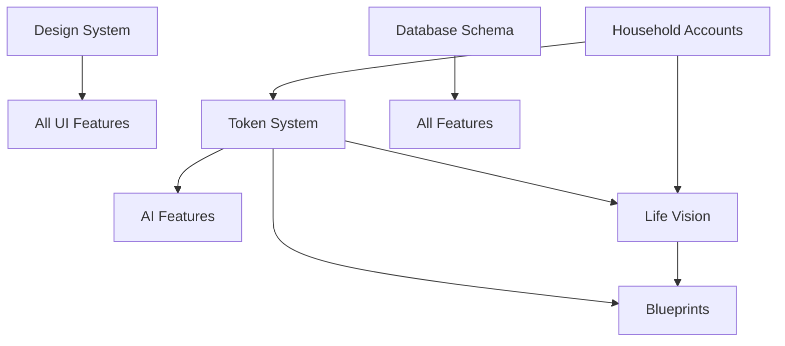

# VibrationFit Feature Registry

**Last Updated:** December 10, 2024  
**Purpose:** Single source of truth for all features, their versions, and status

> ⚠️ **FOR AI AGENTS:** Before modifying ANY feature, check this registry first. Features marked 🔒 LOCKED should NOT be modified without explicit user permission.

---

## How to Use This Registry

### Status Definitions

| Status | Meaning | Agent Action |
|--------|---------|--------------|
| 🔒 **LOCKED** | Working in production, DO NOT touch | Read-only unless explicitly asked |
| ✅ **STABLE** | Working well, modify with caution | Test thoroughly after changes |
| 🚧 **IN PROGRESS** | Currently being built | Safe to modify |
| ⚠️ **NEEDS REVIEW** | May have issues, verify before using | Check functionality first |
| 🗄️ **ARCHIVED** | No longer used | Don't reference |

### Version Format

- **Major.Minor.Patch** (e.g., `v2.1.0`)
- Major = Breaking changes
- Minor = New features
- Patch = Bug fixes

---

## Core Infrastructure

### 🔒 Media Recorder Component
**Version:** `v3.5.0`  
**Status:** 🔒 LOCKED (Used across multiple features)  
**Last Modified:** November 18, 2024  
**Doc:** `src/components/MediaRecorder.tsx` (self-documented)  
**File:** `src/components/MediaRecorder.tsx` (1,350 lines)  
**Used By:** Journal entries, VIVA chat, Life Vision audio, Video recordings

**What It Does:**
- Audio/video recording with browser MediaRecorder API
- Multiple recording purposes:
  - `quick`: Small snippets (VIVA chat) - no S3, instant transcript
  - `transcriptOnly`: Long audio (life vision) - S3 backup, delete if discarded
  - `withFile`: Full recordings (journal) - always keep file
  - `audioOnly`: Audio with editing, no transcription
- IndexedDB persistence (survives page refresh)
- S3 upload integration for cloud storage
- Audio editing with waveform (trim, cut)
- OpenAI Whisper transcription integration
- Microphone selection (multi-device support)
- Pause/resume functionality
- Countdown timer before recording
- Real-time level meter visualization
- Auto-save every 20-30 seconds during recording
- Recovery system for interrupted recordings
- Blob URL management and memory cleanup

**Verification:**
```bash
# Test in journal entry
1. Go to /journal/new
2. Record audio
3. Verify transcription works
4. Verify audio playback works
5. Verify S3 upload successful

# Test recovery
1. Start recording
2. Refresh page
3. Verify "Found saved recording" message
4. Can continue or transcribe saved recording

# Test editing
1. Record audio
2. Click "Edit Recording"
3. Trim/cut audio
4. Verify edited audio plays correctly
```

**Critical Rules:**
- ❌ DO NOT change recording purposes without testing all use cases
- ❌ DO NOT modify IndexedDB schema (breaks recovery)
- ❌ DO NOT change blob creation logic (breaks playback)
- ❌ DO NOT alter transcription flow (used by 4+ features)
- ✅ DO test with real microphone/camera hardware
- ✅ DO test page refresh recovery
- ✅ DO verify S3 uploads work
- ✅ DO check memory cleanup (blob URL revocation)

**Known Gotchas:**
- Blob URLs must be revoked to prevent memory leaks
- MediaRecorder mimeType support varies by browser
- IndexedDB has size limits (recordings auto-cleared after 24h)
- S3 upload runs in parallel with transcription for speed
- Different recording purposes have different cleanup logic

---

### ✅ Audio Editor Component
**Version:** `v1.2.0`  
**Status:** ✅ STABLE  
**Last Modified:** October 28, 2024  
**File:** `src/components/AudioEditor.tsx`  
**Used By:** MediaRecorder (edit mode), Journal audio editing

**What It Does:**
- Waveform visualization with peaks
- Trim audio (set start/end points)
- Real-time preview of edits
- Export edited audio as new blob
- Undo/reset functionality

**Verification:**
```bash
1. Record audio in journal
2. Click "Edit Recording"
3. Drag trim handles
4. Click "Preview Edited"
5. Verify trimmed audio plays correctly
6. Click "Save Changes"
7. Verify edited audio replaces original
```

---

### ✅ Recording Textarea Component
**Version:** `v2.1.0`  
**Status:** ✅ STABLE  
**Last Modified:** November 17, 2024  
**File:** `src/components/RecordingTextarea.tsx`  
**Used By:** Life Vision imagination, Journal entries, VIVA chat

**What It Does:**
- Textarea with integrated voice recording button
- Automatic transcription insertion
- Different recording purposes per use case
- Keyboard shortcuts (Cmd/Ctrl + Shift + R to record)
- Character count display

**Integration Points:**
- Uses MediaRecorder component
- Configurable `recordingPurpose` and `storageFolder`
- Automatically inserts transcript at cursor position

---

### 🔒 Simple Level Meter Component
**Version:** `v1.0.0`  
**Status:** 🔒 LOCKED (Visual feedback component)  
**Last Modified:** September 15, 2024  
**File:** `src/components/SimpleLevelMeter.tsx`  
**Used By:** MediaRecorder (audio visualization during recording)

**What It Does:**
- Real-time audio level visualization
- Two modes: linear bars or circular meter
- Canvas-based rendering for performance
- Audio context integration
- Smooth animations

**Critical Rules:**
- ❌ DO NOT change canvas rendering logic (performance-sensitive)
- ❌ DO NOT modify audio context handling (causes memory leaks if wrong)
- ✅ DO cleanup audio nodes on unmount

---

## Core Features

### 🔒 Life Vision Generation System
**Version:** `v3.2.0`  
**Status:** 🔒 LOCKED (Working in production)  
**Last Modified:** November 17, 2024  
**Doc:** `docs/features/life-vision/README.md`  
**Schema:** `vision_versions`, `life_vision_category_state`, `frequency_flip`  
**API:** `/api/viva/ideal-state`, `/api/viva/flip-frequency`, `/api/viva/merge-clarity`

**What It Does:**
- 6-step vision creation flow across 12 life categories
- AI-generated imagination prompts (profile-aware)
- Frequency flip (contrast → clarity)
- Category-specific ideal state generation
- Vision assembly with bookends (forward/conclusion)

**Verification:**
```bash
# Test the flow works end-to-end
1. Go to /life-vision/new
2. Complete all 6 steps for one category
3. Verify vision_versions.is_draft = true created
4. Verify ideal_state_prompts saved to life_vision_category_state
```

**Critical Rules:**
- ❌ DO NOT modify without testing full flow
- ❌ DO NOT change category keys (use CATEGORY_KEYS constants)
- ❌ DO NOT alter database schema without migration
- ✅ DO regenerate docs after schema changes

---

### 🔒 Design System
**Version:** `v1.8.0`  
**Status:** 🔒 LOCKED (Core UI system)  
**Last Modified:** November 10, 2024  
**Doc:** `docs/design-system/README.md`  
**Source:** `src/lib/design-system/`  
**Reference:** `vibrationfit-brand-kit.html`

**What It Does:**
- Centralized UI components (Button, Card, Input, etc.)
- Brand colors and gradients
- Consistent spacing and typography
- Mobile-responsive patterns

**Components:**
- `Button` (6 variants: primary, secondary, accent, ghost, outline, danger)
- `GradientButton` (5 gradients: brand, green, teal, purple, cosmic)
- `AIButton` (special styling for AI features)
- `Card` (3 variants: default, elevated, outlined)
- `Input`, `Textarea`, `Badge`, `ProgressBar`, `Spinner`
- `Container`, `PageLayout`, `Footer`
- 🔒 `PageHero` (Hero component for page headers with gradient styling)

**Verification:**
```bash
# Visual check
Visit any page and verify:
- Buttons are pill-shaped (rounded-full)
- Cards have 2px borders (#333)
- Colors match brand palette
- Hover states work
- All components import from @/lib/design-system/components
```

**Critical Rules:**
- ❌ DO NOT change button shapes (always rounded-full)
- ❌ DO NOT use colors outside palette (see tokens.ts)
- ❌ DO NOT modify component APIs without checking all usages
- ❌ DO NOT add inline styles (use Tailwind classes)
- ✅ DO import from @/lib/design-system/components
- ✅ DO reference vibrationfit-brand-kit.html for visual style
- ✅ DO test mobile responsive behavior

#### 🔒 PageHero Component - SPECIAL RULES
**Location:** `src/lib/design-system/components.tsx` (lines 6187-6249)  
**Current Padding:** 24px mobile/tablet (`p-6`), 32px desktop (`lg:p-8`)

**Critical Rules:**
- ❌ DO NOT modify internal padding without explicit permission
- ❌ DO NOT add default margins to the component
- ✅ DO manage spacing at the page level using `className` prop
- ✅ DO keep top and bottom padding equal (e.g., `p-6` not `pt-6 pb-3`)

**Correct Usage:**
```tsx
// ✅ Good - spacing managed at page level
<PageHero title="Title" subtitle="Subtitle" className="mb-8" />

// ❌ Bad - modifying component's internal padding
// Don't change p-6 lg:p-8 in the component itself
```

---

### 🔒 Token System (Creation Credits)
**Version:** `v2.3.1`  
**Status:** 🔒 LOCKED (Financial system)  
**Last Modified:** November 15, 2024  
**Doc:** `docs/architecture/TOKEN_SYSTEM_SIMPLIFIED.md`  
**Schema:** `token_transactions`, `token_usage`, `ai_model_pricing`  
**API:** `/api/tokens/balance`, `/api/tokens/grant`, `/api/admin/ai-pricing`

**What It Does:**
- Track user token balances (Creation Credits)
- Log AI usage and costs
- Admin can adjust balances
- Configurable AI model pricing

**Verification:**
```bash
# Test token flow
1. Check balance: GET /api/tokens/balance
2. Use AI feature (e.g., generate vision)
3. Verify token_usage row created
4. Verify balance decreased
```

**Critical Rules:**
- ❌ DO NOT modify token calculations without approval
- ❌ DO NOT change pricing without testing
- ❌ DO NOT allow negative balances
- ✅ DO use trackTokenUsage() for all AI calls

---

### 🔒 Database Schema
**Version:** `v4.12.0`  
**Status:** 🔒 LOCKED (Production database)  
**Last Modified:** November 17, 2024  
**Doc:** `docs/generated/SCHEMA.md` (auto-generated)  
**Source:** `supabase/COMPLETE_SCHEMA_DUMP.sql`  
**Migrations:** `supabase/migrations/`

**What It Does:**
- 55 tables for all features
- RLS policies for security
- Stored functions and triggers

**Verification:**
```bash
# Schema is current
npm run docs:schema
# Check output matches production
```

**Critical Rules:**
- ❌ DO NOT edit tables directly (use migrations)
- ❌ DO NOT run migrations without testing locally first
- ❌ DO NOT modify RLS policies without security review
- ✅ DO create timestamped migrations (YYYYMMDDHHMMSS_description.sql)
- ✅ DO regenerate schema docs after migrations

---

### ✅ AI Model Pricing Management
**Version:** `v1.0.0`  
**Status:** ✅ STABLE  
**Last Modified:** November 15, 2024  
**Doc:** N/A (simple CRUD)  
**Schema:** `ai_model_pricing`  
**API:** `/api/admin/ai-pricing`  
**UI:** `/admin/ai-models` (Model Pricing tab)

**What It Does:**
- Admin configures AI model costs
- Used for token usage cost calculation
- Supports input/output token pricing

**Verification:**
```bash
1. Go to /admin/ai-models
2. Click "Model Pricing" tab
3. Edit a model's pricing
4. Verify cost calculated correctly in token_usage
```

---

### ✅ Household Accounts
**Version:** `v2.0.0`  
**Status:** ✅ STABLE  
**Last Modified:** November 8, 2024  
**Doc:** `docs/architecture/HOUSEHOLD_ACCOUNTS_ARCHITECTURE.md`  
**Schema:** `households`, `household_members`, `household_invitations`  
**API:** `/api/household/*`

**What It Does:**
- Multiple users share one account
- Shared vision, tokens, storage
- Invitation system

---

### 🚧 Actualization Blueprints
**Version:** `v1.5.0`  
**Status:** 🚧 IN PROGRESS  
**Last Modified:** November 12, 2024  
**Doc:** `docs/features/blueprints/README.md`  
**Schema:** `actualization_blueprints`, `blueprint_phases`, `blueprint_tasks`

**What It Does:**
- Turn vision into actionable steps
- 5-phase conscious creation framework
- Task tracking and insights

**Known Issues:**
- Phase completion logic needs review
- Task dependency system not implemented

---

### ⚠️ Vision Refinement Flow
**Version:** `v2.0.0`  
**Status:** ⚠️ NEEDS REVIEW (Recently restored)  
**Last Modified:** November 17, 2024  
**Doc:** `docs/features/life-vision/refinement.md`  
**API:** `/api/viva/refine`  
**UI:** `/life-vision/[id]/refine`

**What It Does:**
- Edit and improve existing visions
- Conversational refinement with VIVA
- Version tracking

**Known Issues:**
- Need to verify integration with new vision_versions structure
- Check if refinements table is still used

---

## Feature Dependencies



---

## Adding a New Feature

1. **Create feature doc:** `docs/features/[feature-name]/README.md`
2. **Add to this registry** with status 🚧 IN PROGRESS
3. **Build feature** with version tracking
4. **Test thoroughly**
5. **Update status** to ✅ STABLE
6. **Lock when production-critical** 🔒 LOCKED

---

## Modifying a Locked Feature

**STOP!** Before touching a 🔒 LOCKED feature:

1. ❓ **Ask user for permission**
2. 📸 **Document current behavior** (screenshots, tests)
3. 🧪 **Create test plan** to verify nothing breaks
4. 🔄 **Make changes incrementally**
5. ✅ **Test the ENTIRE feature** (not just your change)
6. 📝 **Update version number** and this registry
7. 💾 **Commit with clear message** about what changed

**Example commit:**
```
feat(life-vision): add profile context to imagination prompts

FEATURE: Life Vision Generation System
VERSION: v3.2.0 → v3.3.0 (minor - new feature)
STATUS: Still LOCKED (tested, working)

Changes:
- Added profile-aware prompt generation
- Created profile-context.ts utility
- Updated ideal-state API to pass profile data

Verification:
✅ Full 6-step flow tested
✅ Prompts now include user hobbies
✅ No existing functionality broken
```

---

## Version History

| Feature | Version | Date | Change |
|---------|---------|------|--------|
| FEATURE_REGISTRY | v1.0.0 → v1.1.0 | Dec 10 | Added PageHero component with lock rules |
| FEATURE_REGISTRY | - → v1.0.0 | Nov 18 | Added UI components tracking |
| Media Recorder | - → v3.5.0 | Nov 18 | Documented current state (locked) |
| Audio Editor | - → v1.2.0 | Nov 18 | Documented current state (stable) |
| Recording Textarea | - → v2.1.0 | Nov 18 | Documented current state (stable) |
| Simple Level Meter | - → v1.0.0 | Nov 18 | Documented current state (locked) |
| Design System | - → v1.8.0 | Nov 18 | Enhanced documentation with component list |
| Life Vision | v3.2.0 → v3.2.1 | Nov 17 | Added ideal_state_prompts to category_state |
| Life Vision | v3.1.0 → v3.2.0 | Nov 17 | Profile-aware imagination prompts |
| Token System | v2.3.0 → v2.3.1 | Nov 15 | Added audio_seconds tracking |
| AI Model Pricing | v0.0.0 → v1.0.0 | Nov 15 | Initial release |
| Database Schema | v4.11.0 → v4.12.0 | Nov 17 | Added ideal_state_prompts column |

---

## Emergency Rollback

If an agent breaks a locked feature:

```bash
# 1. Find last working commit
git log --oneline --all --grep="FEATURE: [Feature Name]"

# 2. Revert the change
git revert [commit-hash]

# 3. Update registry with incident
# 4. Fix properly with full testing
```

---

**Remember:** This registry is the CONTRACT between features and agents. Respect the locks! 🔒

